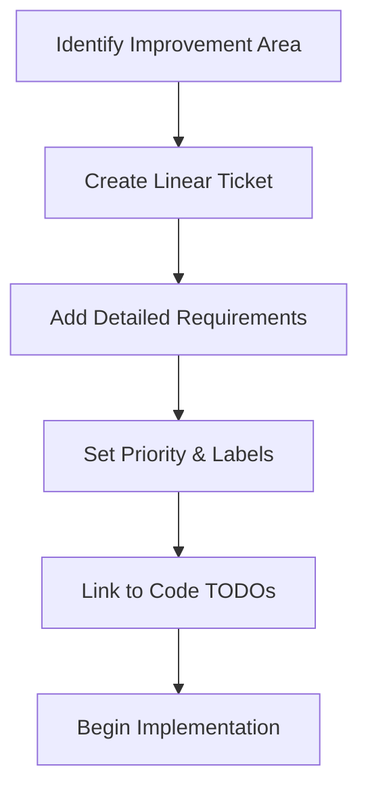
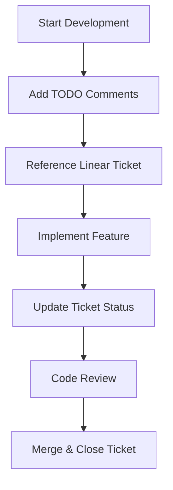

# 🎫 Linear Integration Documentation

This document explains how the WishMaker project integrates with Linear for project management, issue tracking, and development workflow coordination.

## 🎯 Overview

The WishMaker project uses Linear as its primary project management tool, with comprehensive integration between code TODOs and Linear tickets for full traceability and organized development workflow.

## 🏗️ Linear Workspace Structure

### Project Organization
- **Workspace**: romcar
- **Project**: WishMaker
- **Team**: Development Team
- **Ticket Prefix**: ROM-

### Ticket Categories
- **Security & Authentication** (ROM-5 series)
- **Database & Performance** (ROM-8 series)
- **Frontend & UX** (ROM-7 series)
- **Testing & Quality** (ROM-10 series)
- **DevOps & Infrastructure** (ROM-11 series)

## 🎫 Current Linear Tickets

### ROM-5: Security Vulnerabilities & Authentication
**URL**: https://linear.app/romcar/issue/ROM-5/implement-security-vulnerabilities-fixes-and-authentication

**Priority**: Critical
**Status**: In Progress

**Key Components**:
- JWT-based authentication system
- WebAuthn passwordless authentication
- Multi-Factor Authentication (MFA)
- Password security improvements
- Session management
- Rate limiting and security middleware

**Code Integration**:
```typescript
// Example TODO linking
// TODO: CRITICAL - Implement password reset functionality
// 🎫 Linear Ticket: https://linear.app/romcar/issue/ROM-5/
```

### ROM-6: Authentication Features & User Management
**URL**: https://linear.app/romcar/issue/ROM-6/implement-authentication-features-and-user-management

**Priority**: High
**Status**: In Progress

**Key Components**:
- User profile management
- Account verification system
- Admin user management
- Authentication analytics
- User session monitoring

### ROM-7: Frontend Enhancements & User Experience
**URL**: https://linear.app/romcar/issue/ROM-7/implement-frontend-enhancements-and-user-experience

**Priority**: Medium
**Status**: Planned

**Key Components**:
- Responsive design improvements
- Accessibility enhancements
- Performance optimizations
- User interface polish
- Mobile experience improvements

### ROM-8: Database Optimization & Performance
**URL**: https://linear.app/romcar/issue/ROM-8/implement-database-optimization-and-performance-improvements

**Priority**: Medium
**Status**: Planned

**Key Components**:
- Database query optimization
- Indexing strategy
- Connection pooling
- Caching implementation
- Performance monitoring

### ROM-9: API Improvements & Developer Experience
**URL**: https://linear.app/romcar/issue/ROM-9/implement-api-improvements-and-developer-experience

**Priority**: Medium
**Status**: Planned

**Key Components**:
- API documentation generation
- OpenAPI/Swagger integration
- Developer tooling improvements
- SDK development
- API versioning strategy

### ROM-10: Testing Infrastructure Implementation
**URL**: https://linear.app/romcar/issue/ROM-10/implement-comprehensive-testing-infrastructure

**Priority**: High
**Status**: Critical

**Key Components**:
- Unit testing setup (Jest, React Testing Library)
- Integration testing framework
- End-to-end testing (Playwright/Cypress)
- Test automation and CI/CD
- Code coverage reporting

### ROM-11: DevOps Setup & Deployment Automation
**URL**: https://linear.app/romcar/issue/ROM-11/implement-devops-setup-and-deployment-automation

**Priority**: High
**Status**: In Progress

**Key Components**:
- CI/CD pipeline setup
- Production deployment automation
- Environment management
- Monitoring and logging
- Backup and recovery procedures

## 🔗 Code-to-Ticket Integration

### TODO Comment Format

All TODO comments in the codebase follow a standardized format that links directly to Linear tickets:

```typescript
// TODO: [PRIORITY] - [Description]
// 🎫 Linear Ticket: [Linear URL]
// [Detailed implementation steps]
```

### Example Integration

```typescript
// backend/src/controllers/auth.controller.ts
// TODO: CRITICAL - Implement comprehensive password validation
// 🎫 Linear Ticket: https://linear.app/romcar/issue/ROM-5/implement-security-vulnerabilities-fixes-and-authentication
// 1. Add password strength requirements (8+ chars, mixed case, numbers, symbols)
// 2. Implement password history to prevent reuse
// 3. Add password expiration and forced updates
// 4. Create password policy configuration system
// 5. Add breach detection using HaveIBeenPwned API
// 6. Implement account lockout after failed attempts
// 7. Add password recovery with secure token generation
```

### Traceability Benefits

1. **Direct Navigation**: Developers can click Linear URLs in code comments
2. **Context Preservation**: Full implementation details in code alongside tickets
3. **Progress Tracking**: Code completion directly updates ticket progress
4. **Review Efficiency**: Code reviewers can understand broader context
5. **Project Management**: PMs can see code-level progress in Linear

## 📊 Development Workflow

### 1. Ticket Creation Process


### 2. Code Development Process


### 3. Ticket Lifecycle

1. **Planning**: Create ticket with detailed requirements
2. **Development**: Add code TODOs linking to ticket
3. **Implementation**: Develop features according to ticket specifications
4. **Review**: Use ticket context for code review
5. **Completion**: Mark ticket as done when code is merged

## 🛠️ Tools & Integration

### Linear API Integration
```typescript
// Future enhancement: Automatic ticket updates
const updateLinearTicket = async (ticketId: string, status: string) => {
  // Implementation for automatic ticket status updates
  // based on code completion percentage
};
```

### Automated Workflow Features
- **Code Scanning**: Identify TODO comments with Linear links
- **Progress Tracking**: Calculate completion percentage from code TODOs
- **Status Sync**: Update Linear tickets based on code changes
- **Report Generation**: Create development progress reports

## 📈 Metrics & Reporting

### Development Metrics
- **Ticket Completion Rate**: Percentage of tickets closed per sprint
- **Code Coverage**: TODO items implemented vs. total identified
- **Implementation Time**: Average time from ticket creation to completion
- **Quality Metrics**: Bug reports and security issues addressed

### Linear Dashboard Features
- **Sprint Progress**: Visual representation of ticket completion
- **Priority Distribution**: Breakdown of critical, high, medium, low priority items
- **Team Velocity**: Development speed and capacity planning
- **Backlog Health**: Upcoming work organization and estimation

## 🚀 Best Practices

### Creating Effective Tickets
1. **Clear Titles**: Use descriptive, action-oriented titles
2. **Detailed Descriptions**: Include context, requirements, and acceptance criteria
3. **Proper Labeling**: Use consistent labels for categorization
4. **Priority Setting**: Align with business and technical priorities
5. **Linked Resources**: Connect related tickets and documentation

### Code Integration Standards
1. **Consistent Format**: Follow standardized TODO comment format
2. **Implementation Details**: Include specific steps in TODO comments
3. **Regular Updates**: Keep ticket status current with code progress
4. **Review References**: Use ticket links during code reviews
5. **Documentation**: Update docs when tickets are completed

### Workflow Optimization
1. **Sprint Planning**: Use Linear for sprint organization and capacity planning
2. **Standup Integration**: Reference ticket IDs in daily updates
3. **Retrospective Data**: Use Linear metrics for team retrospectives
4. **Continuous Improvement**: Regularly review and optimize workflow processes

## 🔍 Troubleshooting

### Common Issues
- **Broken Links**: Ensure Linear URLs are accessible to all team members
- **Outdated TODOs**: Regularly review and update TODO comments
- **Ticket Drift**: Keep ticket descriptions aligned with implementation reality
- **Permission Issues**: Verify team member access to Linear workspace

### Maintenance Tasks
- Weekly review of open tickets and progress
- Monthly cleanup of completed TODOs from codebase
- Quarterly workflow assessment and optimization
- Annual review of Linear workspace organization

## 📝 Future Enhancements

### Planned Integrations
- [ ] Automated Linear ticket creation from git commits
- [ ] Code coverage integration with Linear progress tracking
- [ ] Slack notifications for ticket status changes
- [ ] GitHub PR integration with Linear ticket references
- [ ] Automated sprint report generation
- [ ] Development velocity analytics dashboard

### Workflow Improvements
- [ ] Template standardization for different ticket types
- [ ] Automated TODO comment scanning and ticket sync
- [ ] Integration with code quality tools (Codacy)
- [ ] Custom Linear fields for development-specific metrics
- [ ] Team capacity planning based on ticket complexity

---

**Last Updated**: October 12, 2025
**Linear Workspace**: https://linear.app/romcar
**Project Status**: Active Development with 7 Active Tickets